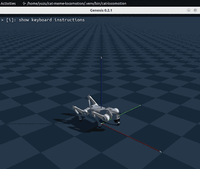
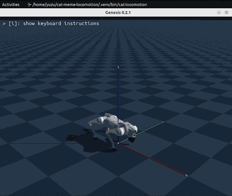
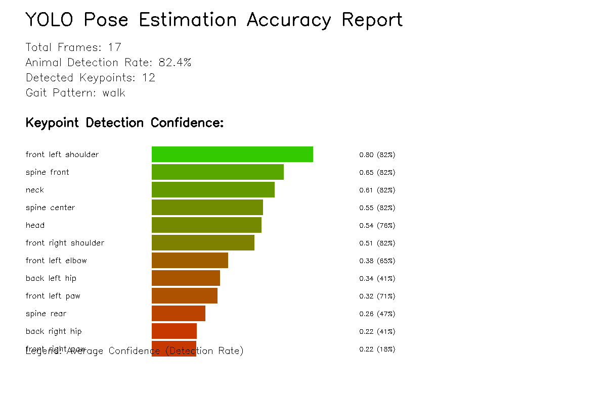

# Cat Meme Locomotion 

[](https://www.python.org/downloads/release/python-3100/)
[](https://docs.opencv.org/4.8.0/)
[](https://github.com/Genesis-Embodied-AI/Genesis)  
[](https://www.python.org/)
[](https://releases.ubuntu.com/jammy/)
[](https://developer.nvidia.com/cuda-toolkit)


This project allows the Unitree Go2 robot to mimic the locomotion from popular cat memes. By analyzing videos and GIFs, this controller enables the robot to replicate those unique and hilarious motions🐈

<p align="center">
  
  
  <br>
  <i>The robot mimicking the movements of a cat meme.</i>
</p>

## Features 

- **Supports both GIFs and videos (MP4)**
- **Multiple pose estimation methods**:
  - **CV-Pose**: OpenCV-based animal pose estimation with accuracy metrics
  - **YOLO**: State-of-the-art pose estimation with human-to-animal keypoint mapping
- **Simulation**: Using Genesis physics engine
- **Accuracy tracking**: Detection rate, confidence scores, and tracking consistency

### Example Input GIFs
<p align="center">
  
  
  
</p>

## Installation 

### Requirements

- Python 3.10+
- CUDA-compatible GPU (recommended)
- Ubuntu 20.04/22.04 (recommended)

### Installation with UV (recommended)

```bash
# Clone the repository
git clone https://github.com/yourusername/cat-meme-locomotion.git
cd cat-meme-locomotion

# Install UV (if not already installed)
curl -LsSf https://astral.sh/uv/install.sh | sh

# Install dependencies
uv pip install -e .
```

### Installation with traditional pip

```bash
# Create virtual environment
python -m venv venv
source venv/bin/activate  # Windows: venv\Scripts\activate

# Install
pip install -e .
```

## Usage 

### Basic Usage

```bash
# Process GIF with YOLO pose estimation (real keypoint detection)
uv run cat-locomotion yolo --gif assets/gifs/dancing-dog.gif --model yolov8x-pose.pt

# Process GIF with CV-based pose estimation (no ML required)
uv run cat-locomotion cv-pose --gif assets/gifs/dancing-dog.gif

# Process MP4 video with YOLO 
uv run cat-locomotion yolo --gif assets/mp4/kitten-walking.mp4 --model yolov8n-pose.pt

# Process MP4 with CV-pose 
uv run cat-locomotion cv-pose --gif assets/mp4/dog-running.mp4 --amplitude 1.2

# Adjust parameters
uv run cat-locomotion cv-pose --gif assets/gifs/happy-cat.gif --speed 1.5 --amplitude 2.0
```

### Processing Examples

<p align="center">
  <table>
    <tr>
      <td align="center">
        <br>
        <b>Input: Cat Punch</b>
      </td>
      <td align="center">→</td>
      <td align="center">
        <br>
        <b>Output: Pose Tracking</b>
      </td>
      <td align="center">→</td>
      <td align="center">
        <br>
        <b>Robot Simulation</b>
      </td>
    </tr>
    <tr>
      <td align="center">
        <br>
        <b>Input: Dancing Dog</b>
      </td>
      <td align="center">→</td>
      <td align="center">
        <br>
        <b>Output: Pose Tracking</b>
      </td>
      <td align="center">→</td>
      <td align="center">
        <br>
        <b>Robot Simulation</b>
      </td>
    </tr>
  </table>
</p>

### Available Controllers

| Controller | Description | Use Case |
|--------------|------|------|
| `cv-pose` | OpenCV-based animal pose estimation with accuracy metrics | Best for animal GIFs, no ML required |
| `yolo` | YOLO pose estimation with human-to-animal keypoint mapping | Works for humans and animals |
| `simple` | Simple direct mapping | Basic movements |
| `official` | Original enhanced motion extraction | Traditional method |

### Command Line Options

```bash
# Show help
uv run cat-locomotion --help
uv run cat-locomotion cv-pose --help

# Common options
--gif PATH          # Input GIF/video file path
--speed FLOAT       # Motion speed multiplier (default: 1.0)
--amplitude FLOAT   # Motion amplitude multiplier (default: 1.2)

# YOLO only
--model MODEL       # YOLO model (yolov8x-pose.pt, yolov8n-pose.pt, etc.)
```

## Genesis Robot Simulation Results

The `genesis_robot_gifs/` directory contains GIF recordings of the Genesis robot simulating the movements from various cat memes:

<p align="center">
  <table>
    <tr>
      <td align="center">
        <br>
        <b>CV-Pose: Cat Punch Simulation</b>
      </td>
      <td align="center">
        <br>
        <b>YOLO: Cat Punch Simulation</b>
      </td>
    </tr>
    <tr>
      <td align="center">
        <br>
        <b>CV-Pose: Chipi Chipi Chapa Chapa</b>
      </td>
      <td align="center">
        <br>
        <b>YOLO: Chipi Chipi Chapa Chapa</b>
      </td>
    </tr>
    <tr>
      <td align="center">
        <br>
        <b>CV-Pose: Dancing Dog</b>
      </td>
      <td align="center">
        <br>
        <b>YOLO: Dancing Dog</b>
      </td>
    </tr>
    <tr>
      <td align="center">
        <br>
        <b>CV-Pose: Happy Cat</b>
      </td>
      <td align="center">
        <br>
        <b>YOLO: Happy Cat</b>
      </td>
    </tr>
  </table>
</p>

## Output Files 

When you run the program, the following files are automatically generated in the `outputs/` directory:

### CV-Pose Outputs
- `cv_pose_*.png` - Comprehensive visualization with accuracy metrics
- `cv_tracking_*.gif` - Motion tracking animation with skeleton overlay

<p align="center">
  
  <br>
  <i>CV-Pose analysis showing keypoints, trajectories, confidence over time, and accuracy metrics</i>
</p>

The PNG output includes:
- **Keypoint Detection**: Visualized on the actual frame with detection count
- **Keypoint Trajectories**: Movement paths of all tracked keypoints
- **Confidence Over Time**: Per-keypoint confidence graphs
- **Accuracy Metrics**:
  - Overall Detection Rate
  - High Confidence Detection Rate
  - Tracking Consistency
  - Keypoint Coverage
  - Per-keypoint accuracy details

### YOLO Outputs
- `yolo_keypoints_*.png` - Visualization of detected keypoints
- `yolo_tracking_*.gif` - Motion capture animation (always outputs GIF regardless of input format)
<p align="center">
  
  <br>
  <i>YOLO-Pose analysis showing keypoints confidence over time</i>
</p>

## Pose Estimation Method Comparison 

| Feature | CV-Pose | YOLO |
|------|---------------|--------|
| **Detection Method** | Computer Vision (SIFT, contour, color) | Deep Learning pose estimation |
| **Target** | Designed for animals | Human pose → Animal mapping |
| **Accuracy Metrics** | ✅ Full accuracy analysis | Basic confidence scores |
| **Processing Speed** | Fast | Fast with GPU |
| **External Dependencies** | None (OpenCV only) | ultralytics |
| **Output Quality** | High with accuracy tracking | High |

## Troubleshooting 

### If the robot doesn't move
- All controllers have fallback motion implemented, so basic movements will be generated even if keypoints are not detected
- Try increasing the `--amplitude` parameter (e.g., `--amplitude 2.0`)

### Low detection accuracy for MP4
- We recommend using the CV-Pose controller: `cat-locomotion cv-pose --gif video.mp4`
- For better results:
  - Use videos where the animal appears large
  - Choose videos with simple backgrounds
  - Videos with many side-view poses work best

### GPU-related errors
```bash
# Run in CPU mode (slow but works)
CUDA_VISIBLE_DEVICES="" uv run cat-locomotion cv-pose --gif assets/gifs/happy-cat.gif
```

## Project Structure 

```
cat-meme-locomotion/
├── src/cat_meme_locomotion/
│   ├── core/
│   │   ├── cv_animal_pose_extractor.py  # CV-based animal pose estimation
│   │   ├── yolo_pose_extractor.py       # YOLO-based pose estimation
│   │   └── motion_extractor.py          # Basic motion extraction
│   ├── unitree_cv_pose_controller.py    # CV-Pose robot controller
│   ├── unitree_yolo_controller.py       # YOLO robot controller
│   └── cli.py                           # Command line interface
├── assets/
│   ├── gifs/                            # Sample GIF files
│   └── mp4/                             # Sample video files
├── outputs/                             # Generated output files
└── pyproject.toml                       # Project configuration
```

## Development 

### Development Environment Setup

```bash
# Install development dependencies
uv pip install -e ".[dev]"

# Code formatting
black src/
ruff check src/

# Run tests
pytest tests/
```

### Adding a New Controller

1. Create a new controller file in `src/cat_meme_locomotion/`
2. Add a new subcommand to `cli.py`
3. Update README


## Acknowledgments 

- [Genesis](https://github.com/Genesis-Embodied-AI/Genesis) - Physics simulation
- [Unitree Robotics](https://www.unitree.com/) - Go2 robot model
- [Ultralytics](https://github.com/ultralytics/ultralytics) - YOLOv8 implementation
