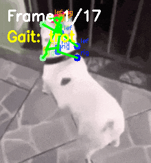

# Cat Meme Locomotion 🐱🤖

A controller that enables Unitree Go2 robots to mimic movements from cat GIFs/videos. Supports multiple pose estimation methods and automatically generates motion capture and learning results.

<p align="center">
  
</p>

## Features ✨

- 🎬 **Supports both GIFs and videos (MP4)**
- 🤖 **Multiple pose estimation methods**:
  - **YOLO**: State-of-the-art pose estimation with human-to-animal keypoint mapping
  - **YOLO**: Deep learning-based pose estimation (human model)
  - **CV-Pose**: Simple OpenCV-based animal pose estimation
  - **Simple**: Direct keypoint mapping
- 📊 **Automatically generated outputs**:
  - Motion capture GIFs
  - Keypoint visualization
  - Learning metrics (confidence, detection count trends)
- 🎮 **Real-time simulation**: Using Genesis physics engine

### Example Input GIFs
<p align="center">
  
  
  
</p>

## Installation 🚀

### Requirements

- Python 3.10+
- CUDA-compatible GPU (recommended)
- Ubuntu 20.04/22.04

### Installation with UV (recommended)

```bash
# Clone the repository
git clone https://github.com/yourusername/cat-meme-locomotion.git
cd cat-meme-locomotion

# Install UV (if not already installed)
curl -LsSf https://astral.sh/uv/install.sh | sh

# Install dependencies
uv pip install -e .
```

### Installation with traditional pip

```bash
# Create virtual environment
python -m venv venv
source venv/bin/activate  # Windows: venv\Scripts\activate

# Install
pip install -e .
```

## Usage 🎮

### Basic Usage

```bash
# Process GIF with YOLO pose estimation (real keypoint detection)
uv run cat-locomotion yolo --gif assets/gifs/dancing-dog.gif --model yolov8x-pose.pt

# Process GIF with CV-based pose estimation (no ML required)
uv run cat-locomotion cv-pose --gif assets/gifs/dancing-dog.gif

# Process MP4 video with YOLO (outputs MP4)
uv run cat-locomotion yolo --gif assets/mp4/kitten-walking.mp4 --model yolov8n-pose.pt

# Process MP4 with CV-pose (now supports video!)
uv run cat-locomotion cv-pose --gif assets/mp4/dog-running.mp4 --amplitude 1.2

# Adjust parameters
uv run cat-locomotion cv-pose --gif assets/gifs/happy-cat.gif --speed 1.5 --amplitude 2.0
```

### Processing Examples

<p align="center">
  <table>
    <tr>
      <td align="center">
        <br>
        <b>Input: Dancing Dog</b>
      </td>
      <td align="center">→</td>
      <td align="center">
        <br>
        <b>Output: Motion Tracking</b>
      </td>
    </tr>
  </table>
</p>

### Available Controllers

| Controller | Description | Use Case |
|--------------|------|------|
| `yolo` | YOLO pose estimation with human-to-animal keypoint mapping | Real pose estimation for any subject |
| `cv-pose` | OpenCV-based pose estimation | Fast, works without ML dependencies |
| `simple` | Simple direct mapping | Basic movements |
| `official` | Original enhanced motion extraction | Traditional method |

### Command Line Options

```bash
# Show help
uv run cat-locomotion --help
uv run cat-locomotion cv-pose --help

# Common options
--gif PATH          # Input GIF/video file path
--speed FLOAT       # Motion speed multiplier (default: 1.0)
--amplitude FLOAT   # Motion amplitude multiplier (default: 1.2)

# YOLO only
--model MODEL       # YOLO model (yolov8x-pose.pt, yolov8n-pose.pt, etc.)
```

## Output Files 📁

When you run the program, the following files are automatically generated in the `outputs/` directory:

### YOLO Pose
- `yolo_keypoints_*.png` - Visualization of detected keypoints with animal mapping
- `yolo_tracking_*.gif` - Motion capture animation (for GIF input)
- `yolo_tracking_*.mp4` - Motion capture video (for MP4 input)
- Automatic human-to-animal keypoint mapping for natural quadruped motion
- Real pose estimation using state-of-the-art YOLO models
- **Supports both GIF and MP4 input/output**

<p align="center">
  <table>
    <tr>
      <td align="center">
        <br>
        <b>Keypoints Detection</b>
      </td>
      <td align="center">
        <br>
        <b>Tracking Metrics</b>
      </td>
    </tr>
    <tr>
      <td align="center">
        <br>
        <b>Motion Capture Result</b>
      </td>
      <td align="center">
        <br>
        <b>Confidence Heatmap</b>
      </td>
    </tr>
  </table>
</p>

### YOLO
- `yolo_keypoints_*.png` - YOLO-detected keypoints
- `yolo_tracking_*.gif` - Tracking result animation
- `yolo_metrics_*/` - Detection metrics

## Pose Estimation Method Comparison 🔍

| Feature | YOLO | CV-Pose |
|------|--------|---------------|
| **Detection Method** | Deep Learning pose estimation | Computer Vision (SIFT, color, contour) |
| **Target** | Human pose → Animal mapping | Designed for animals |
| **Accuracy** | High (real keypoints) | High |
| **Processing Speed** | Fast with GPU | Fast |
| **External Dependencies** | ultralytics | None (OpenCV only) |
| **Video Support** | ✅ MP4 input/output | ✅ MP4 input |
| **GIF Support** | ✅ GIF input/output | ✅ GIF input |

### Visual Comparison
<p align="center">
  <br>
  <i>CV-Pose accurately detects animal keypoints with specialized computer vision techniques</i>
</p>

## Troubleshooting 🔧

### If the robot doesn't move
- All controllers have fallback motion implemented, so basic movements will be generated even if keypoints are not detected
- Try increasing the `--amplitude` parameter (e.g., `--amplitude 2.0`)

### Low detection accuracy for MP4
- We recommend using the CV-Pose controller: `cat-locomotion cv-pose --gif video.mp4`
- For better results:
  - Use videos where the animal appears large
  - Choose videos with simple backgrounds
  - Videos with many side-view poses work best

### GPU-related errors
```bash
# Run in CPU mode (slow but works)
CUDA_VISIBLE_DEVICES="" uv run cat-locomotion cv-pose --gif assets/gifs/happy-cat.gif
```

## Project Structure 📂

```
cat-meme-locomotion/
├── src/cat_meme_locomotion/
│   ├── core/
│   │   ├── yolo_pose_extractor.py     # YOLO-based pose estimation
│   │   ├── yolo_pose_extractor.py     # YOLO pose estimation
│   │   └── motion_extractor.py        # Basic motion extraction
│   ├── unitree_yolo_controller.py     # YOLO robot controller
│   ├── unitree_yolo_controller.py     # YOLO robot controller
│   └── cli.py                         # Command line interface
├── assets/
│   ├── gifs/                          # Sample GIF files
│   └── mp4/                           # Sample video files
├── outputs/                           # Generated output files
└── pyproject.toml                     # Project configuration
```

## Development 💻

### Development Environment Setup

```bash
# Install development dependencies
uv pip install -e ".[dev]"

# Code formatting
black src/
ruff check src/

# Run tests
pytest tests/
```

### Adding a New Controller

1. Create a new controller file in `src/cat_meme_locomotion/`
2. Add a new subcommand to `cli.py`
3. Update README

## License 📄

This project is released under the MIT License. See the [LICENSE](LICENSE) file for details.

## Acknowledgments 🙏

- [Genesis](https://github.com/Genesis-Embodied-AI/Genesis) - Physics simulation
- [Unitree Robotics](https://www.unitree.com/) - Go2 robot model
- [Ultralytics](https://github.com/ultralytics/ultralytics) - YOLOv8 implementation

## Contributing 🤝

Pull requests are welcome! For major changes, please open an issue first to discuss what you would like to change.

1. Fork the project
2. Create your feature branch (`git checkout -b feature/AmazingFeature`)
3. Commit your changes (`git commit -m 'Add some AmazingFeature'`)
4. Push to the branch (`git push origin feature/AmazingFeature`)
5. Open a Pull Request

## Future Improvements 🚧

- [ ] Implement animal-specific pose estimation models
- [ ] Support real-time webcam input
- [ ] Support more robot models
- [ ] Implement 3D pose estimation
- [ ] Motion learning and style transfer